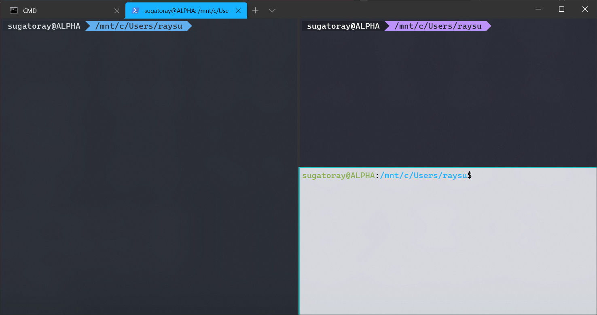

# Setting up Windows Terminal

## Managing Global Settings in `settings.json`


## Using command-line arguments for Windows Terminal

See this document for more details: https://docs.microsoft.com/en-us/windows/terminal/command-line-arguments?tabs=windows

```bash
wt -p "Command Prompt" ; new-tab -p "Ubuntu" ; split-pane -p "Ubuntu-Zsh" ; split-pane -H wsl.exe bash
```
<details>
  <summary>Click to expand and see the figure</summary>
  

</details>

<!---
[![demo split panes][#wt-demo-split-panes]][#wt-demo-split-panes]
--->
[#wt-demo-split-panes]: ./resources/windows_terminal_multipane.png


## GUID

  The `guid` parameter for every entry in the `settings.json` profile file for the Windows Terminal, is essentially an unique id. 
  
  > TL;DR
  > - In order to set a profile as the default profile you must enter the profile's GUID into the global "defaultProfile" setting.
  >
  > - GUIDS are not magical. They are not managed by some central authority. You don't have to ask anyone to generate or use a GUID. 
  They're just numbers that are so big that their chances of clash are limited.
  > 
  > - How to generate:
  >
  >   - Powershell: `[guid]::NewGuid()`
  >   - Linux: `uuidgen`

## Color Schemes: 
  
  The color schemes can be changed as documented here: https://docs.microsoft.com/en-us/windows/terminal/customize-settings/color-schemes.
  
  - Default color schemes: 
  
    [**Included color schemes**][#included-color-schemes]
    
    [#included-color-schemes]: https://docs.microsoft.com/en-us/windows/terminal/customize-settings/color-schemes#included-color-schemes
    
    - [x] [Campbell][#campbell]:                `"colorScheme": "Campbell"`
    - [x] [Campbell Powershell][#campbell-ps]:  `"colorScheme": "Campbell Powershell"`
    - [x] [Vintage][#vintage]:                  `"colorScheme": "Vintage"`
    - [x] [One Half Dark][#one-half-dark]:      `"colorScheme": "One Half Dark"`
    - [x] [One Half Light][#one-half-light]:    `"colorScheme": "One Half Light"`
    - [x] [Tango Dark][#tango-dark]:            `"colorScheme": "Tango Dark"`
    - [x] [Tango Light][#tango-light]:          `"colorScheme": "Tango Light"`
    - [x] [Solarized Dark][#solarized-dark]:    `"colorScheme": "Solarized Dark"`
    - [x] [Solarized Light][#solarized-light]:  `"colorScheme": "Solarized Light"`
    
    [#campbell]: https://docs.microsoft.com/en-us/windows/terminal/customize-settings/color-schemes#campbell
    [#campbell-ps]: https://docs.microsoft.com/en-us/windows/terminal/customize-settings/color-schemes#campbell-powershell
    [#vintage]: https://docs.microsoft.com/en-us/windows/terminal/customize-settings/color-schemes#vintage
    [#one-half-dark]: https://docs.microsoft.com/en-us/windows/terminal/customize-settings/color-schemes#one-half-dark
    [#one-half-light]: https://docs.microsoft.com/en-us/windows/terminal/customize-settings/color-schemes#one-half-light
    [#tango-dark]: https://docs.microsoft.com/en-us/windows/terminal/customize-settings/color-schemes#tango-dark
    [#tango-light]: https://docs.microsoft.com/en-us/windows/terminal/customize-settings/color-schemes#tango-light
    [#solarized-dark]: https://blogs.windows.com/windowsdeveloper/2020/06/30/3-ways-to-customize-your-windows-terminal/
    [#solarized-light]: https://blogs.windows.com/windowsdeveloper/2020/06/30/3-ways-to-customize-your-windows-terminal/
    
  - Custom color schemes: https://docs.microsoft.com/en-us/windows/terminal/custom-terminal-gallery/custom-schemes
    - [x] [Frosted Glass][#forsted-glass]:           `"colorScheme": "Frost"`
    - [x] [Powerline][#powerline]:                   `"colorScheme": "Powerline"`
    - [x] [Raspberry Ubuntu][#raspberry-ubuntu]:     `"colorScheme": "Raspberry"`
    - [x] [Retro Command][#retro-command]:           `"colorScheme": "Retro"`    
    
    [#forsted-glass]: https://docs.microsoft.com/en-us/windows/terminal/custom-terminal-gallery/custom-schemes#frosted-glass
    [#powerline]: https://docs.microsoft.com/en-us/windows/terminal/custom-terminal-gallery/custom-schemes#powerline
    [#raspberry-ubuntu]: https://docs.microsoft.com/en-us/windows/terminal/custom-terminal-gallery/custom-schemes#raspberry-ubuntu
    [#retro-command]: https://docs.microsoft.com/en-us/windows/terminal/custom-terminal-gallery/custom-schemes#retro-command
    
  - External Custom Color schemes
  
    - [x] [Dracula][#dracula]:                       `"colorScheme": "Dracula"`
    
    [#dracula]: https://draculatheme.com/windows-terminal

## Using Powerline Fonts

### Install fonts
See the video from here: [_Tutorial: Set up Powerline in Windows Terminal_][#ps-powerline-fonts-setup]

[#ps-powerline-fonts-setup]: https://docs.microsoft.com/en-us/windows/terminal/tutorials/powerline-setup

1. Download the `.zip` file of the latest release of Cascadia Code from its GitHub repo: https://github.com/microsoft/cascadia-code/releases

At the time of writing this document, the latest release file was: `CascadiaCode-2009.22.zip` [[Link to the zip file][#zip-file]]

[#zip-file]: https://github.com/microsoft/cascadia-code/releases/download/v2009.22/CascadiaCode-2009.22.zip

1. The files that you need to install are:

```bash
# See inside the ttf directory
# You only need the true-type-fonts (.ttf) 
# that **end with** PL (for PowerLine abbreviation).

CascadiaCodePL.ttf
CascadiaMonoPL.ttf
```

1. Open `C:\Windows\Fonts` and drag and drop the relevant files (_that we selected in the last step_). This will start installing these files. Once installation finishes, move to the next section. 

> It is a very good idea to watch the video in [this tutorial][#ps-powerline-fonts-setup] alongside.

### Setup Windows PowerShell Profile


```bash
## Step - 1
echo $PROFILE
# C:\Users\raysu\Documents\WindowsPowerShell\Microsoft.PowerShell_profile.ps1

## Step - 2
start C:\Users\raysu\Documents\WindowsPowerShell\
# this opens the location in explorer

## Step - 3
notepad $PROFILE
# this opens the file if it already exists 
# OR ... 
# creates a new powershell-profile with user's permission
```

Paste the following content to the `powershell-profile` file.

```bash
## Step - 4
# save the following content to $PROFILE
# >>> notepad $PROFILE
# change execution-policy from elevated PowerShell
# >>> Set-ExecutionPolicy RemoteSigned -Scope LocalMachine

Import-Module posh-git
Import-Module oh-my-posh
Set-Theme Paradox
```

**A known problem/bug**:

The defaault **`ExceutionPolicy`** in Windows is `Restricted`. This **blocks** execution of any `.ps1` script. As you can see, the following error was thrown right after PowerShell started and tried to run the script located at `$PROFILE`. The `$PROFILE` is an environment variable that points to the default location of `Microsoft.PowerShell_profile.ps1` file.

See [PowerShell Execution Policies][#ps-execution-policies] for more details.

[#ps-execution-policies]: https://docs.microsoft.com/en-us/powershell/module/microsoft.powershell.core/about/about_execution_policies?view=powershell-7

```bash
Windows PowerShell
Copyright (C) Microsoft Corporation. All rights reserved.

Try the new cross-platform PowerShell https://aka.ms/pscore6

. : File C:\Users\raysu\Documents\WindowsPowerShell\Microsoft.PowerShell_profile.ps1 cannot be loaded because running
scripts is disabled on this system. For more information, see about_Execution_Policies at
https:/go.microsoft.com/fwlink/?LinkID=135170.
At line:1 char:3
+ . 'C:\Users\raysu\Documents\WindowsPowerShell\Microsoft.PowerShell_pr ...
+   ~~~~~~~~~~~~~~~~~~~~~~~~~~~~~~~~~~~~~~~~~~~~~~~~~~~~~~~~~~~~~~~~~~~
    + CategoryInfo          : SecurityError: (:) [], PSSecurityException
    + FullyQualifiedErrorId : UnauthorizedAccess
PS C:\Users\raysu>
```

> **REMEDY**  
>
> Open PowerShell as an administrator (in *elevated* mode) and run the following command to change the `ExceutionPolicy` for local scripts. 
>
> ```bash
> Set-ExecutionPolicy RemoteSigned -Scope LocalMachine
> ```


## References

1. [Tutorial: Set up Powerline in Windows Terminal](https://docs.microsoft.com/en-us/windows/terminal/tutorials/powerline-setup) :star: :star: :star:

1. [How to make a pretty prompt in Windows Terminal with `Powerline`, `Nerd Fonts`, `Cascadia Code`, `WSL`, and `oh-my-posh` _by_ Scott Hanselman](https://www.hanselman.com/blog/how-to-make-a-pretty-prompt-in-windows-terminal-with-powerline-nerd-fonts-cascadia-code-wsl-and-ohmyposh)

1. [Powerline in PowerShell theme for Windows Terminal](https://docs.microsoft.com/en-us/windows/terminal/custom-terminal-gallery/powerline-in-powershell)

1. [Color schemes in Windows Terminal](https://docs.microsoft.com/en-us/windows/terminal/customize-settings/color-schemes)

1. [Custom Terminal guide](https://docs.microsoft.com/en-us/windows/terminal/custom-terminal-gallery/custom-schemes)

1. [Global settings in Windows Terminal](https://docs.microsoft.com/en-us/windows/terminal/customize-settings/global-settings)

1. [How to set user-specified `tabTitle`s](https://github.com/microsoft/terminal/issues/2241#issuecomment-716955598) :star: :star:

1. [Using command-line arguments for Windows Terminal](https://docs.microsoft.com/en-us/windows/terminal/command-line-arguments?tabs=windows) :star:

1. [Windows Terminal: Generating GUIDs For Your Profiles - _by_ Travis Colbert](https://traviscolbert.net/blog/windows-terminal-generating-guids-for-your-profiles/)

1. [Set-ExecutionPolicy](https://docs.microsoft.com/en-us/powershell/module/microsoft.powershell.security/set-executionpolicy?view=powershell-7)

1. [PowerShell ExecutionPolicies](https://docs.microsoft.com/en-us/powershell/module/microsoft.powershell.core/about/about_execution_policies?view=powershell-7#powershell-execution-policies)

1. [Beautify your Windows Terminal](https://dev.to/anupa/beautify-your-windows-terminal-1la8)

1. [3 Ways to Customize Your Windows Terminal](https://blogs.windows.com/windowsdeveloper/2020/06/30/3-ways-to-customize-your-windows-terminal/)

1. [How to change the color scheme in the new Windows Terminal](https://aavtech.site/2020/03/how-to-change-the-color-scheme-in-the-new-windows-terminal/) :star:
